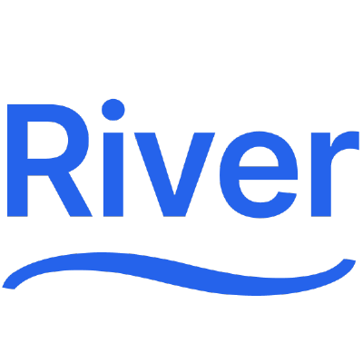

  

River is a robust high-performance job processing system for Go and Postgres.

Being built for Postgres, River encourages the use of the same database for
application data and job queue. By enqueueing jobs transactionally along with
other database changes, whole classes of distributed systems problems are
avoided. Jobs are guaranteed to be enqueued if their transaction commits, are
removed if their transaction rolls back, and aren't visible for work _until_
commit. See [transactional enqueueing] for more background on this philosophy.

You might be interested in:

* [riverqueue.com](https://riverqueue.com), the main landing page for the product.
* The [main River repository](https://github.com/riverqueue/river), containing the Go project that directs how jobs are worked.
* [River's documentation](https://riverqueue.com/docs), containing detailed usage information and examples.
* [River UI](https://github.com/riverqueue/riverui) (and [live demo](https://ui.riverqueue.com)), a self-hosted graphical interface for queue management.

[transactional enqueueing]: https://riverqueue.com/docs/transactional-enqueueing